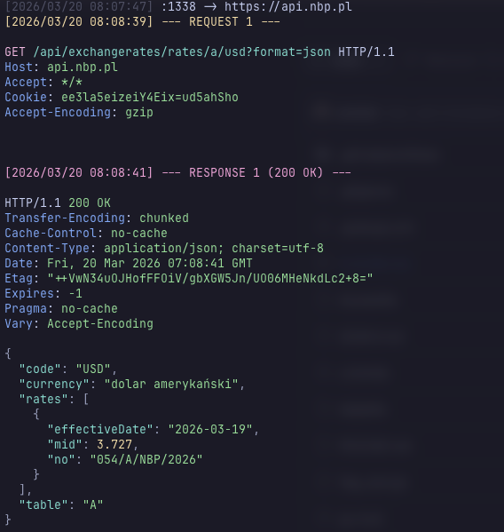

# HTTP Proxy Logger

HTTP Proxy Logger is a small reverse proxy that prints incoming HTTP requests
and outgoing responses to stdout. Bodies compressed with `gzip`, `deflate`, or `br`
are automatically decompressed in the logs so that you can easily inspect them.
The output uses ANSI colors similar to `HTTPie`: request and response lines,
header names, and JSON or XML bodies are highlighted for readability.

## Example output



## Installation

### Homebrew (macOS)

```bash
brew install stn1slv/tap/http-proxy-logger
```

### Download binary (Linux / Windows / macOS)

Pre-built binaries for all platforms are available on the
[Releases](https://github.com/stn1slv/http-proxy-logger/releases/latest) page.

Download the binary for your OS/architecture, make it executable, and move it
to a directory in your `PATH`:

```bash
# Example for Linux amd64
curl -fsSL https://github.com/stn1slv/http-proxy-logger/releases/latest/download/http-proxy-logger-linux-amd64 -o http-proxy-logger
chmod +x http-proxy-logger
sudo mv http-proxy-logger /usr/local/bin/
```

### Docker

```bash
docker pull stn1slv/http-proxy-logger
```

### From source

Requires **Go 1.26+**.

```bash
go build -o http-proxy-logger
```

## Running

Set the `TARGET` environment variable to the upstream server and optionally
`PORT` for the listen address. These values can also be provided with the
`-target` and `-port` flags which override the environment.

Use the `-requests` and `-responses` flags to control which messages are
printed. Both default to `true`.

Use the `-no-color` flag to disable colored output and remove ANSI color codes
from the logs, useful for redirecting output to files or when colors are not
desired.

The tool automatically highlights JSON and XML bodies with syntax coloring and
proper formatting while preserving important structural information like XML
namespaces and namespace prefixes (e.g., `soapenv:Envelope`).

### Local execution

```bash
./http-proxy-logger -target http://example.com -port 8888 -responses=false
```

To disable colored output:

```bash
./http-proxy-logger -target http://example.com -port 8888 -no-color=true
```

### Docker

```bash
docker run --rm -it -p 8888:8888 \
  stn1slv/http-proxy-logger \
  -target http://demo7704619.mockable.io \
  -port 8888
```
Add `-responses=false` to log only requests or `-requests=false` to log only
responses. Add `-no-color=true` to disable colored output. Flags `-target` and 
`-port` may be used instead of the corresponding environment variables.

The proxy will forward traffic to the target and log each request/response pair
using the format shown above.

## License

This project is licensed under the MIT License.
