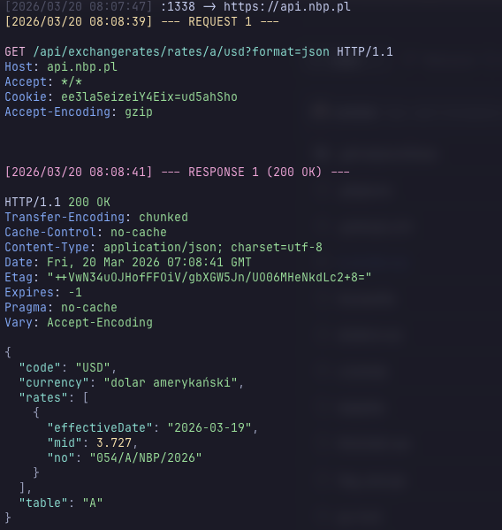

# HTTP Proxy Logger

HTTP Proxy Logger is a small reverse proxy that prints incoming HTTP requests
and outgoing responses to stdout. Bodies compressed with `gzip`, `deflate`, or `br`
are automatically decompressed in the logs so that you can easily inspect them.
The output uses ANSI colors similar to `HTTPie`: request and response lines,
header names, and JSON or XML bodies are highlighted for readability.

> **For debugging only.** This tool is meant for local development and troubleshooting. It logs full request and response headers and bodies, including credentials such as `Authorization` headers and cookies, and it is not built for production traffic or untrusted networks.

## Example output



## Installation

### Homebrew (macOS)

```bash
brew install stn1slv/tap/http-proxy-logger
```

### Download binary (Linux / Windows / macOS)

Pre-built binaries for all platforms are available on the
[Releases](https://github.com/stn1slv/http-proxy-logger/releases/latest) page.

Download the binary for your OS/architecture, make it executable, and move it
to a directory in your `PATH`:

```bash
# Example for Linux amd64
curl -fsSL https://github.com/stn1slv/http-proxy-logger/releases/latest/download/http-proxy-logger-linux-amd64 -o http-proxy-logger
chmod +x http-proxy-logger
sudo mv http-proxy-logger /usr/local/bin/
```

Releases after v1.2.4 also include a `SHA256SUMS` file. To verify a download, save it next to the binary before renaming the binary, then run `sha256sum -c SHA256SUMS --ignore-missing`.

### Docker

```bash
docker pull stn1slv/http-proxy-logger
```

### From source

Requires **Go 1.26+**.

```bash
go build -o http-proxy-logger
```

## Configuration

Each setting is resolved in this order: **CLI flag → environment variable → default**.

| Setting        | Flag          | Environment | Default               |
|----------------|---------------|-------------|-----------------------|
| Target URL     | `-target`     | `TARGET`    | `http://example.com`  |
| Listen port    | `-port`       | `PORT`      | `1338`                |
| Log requests   | `-requests`   | —           | `true`                |
| Log responses  | `-responses`  | —           | `true`                |
| Disable color  | `-no-color`   | `NO_COLOR`  | `false`               |

`NO_COLOR` follows the [no-color.org](https://no-color.org/) convention: any
non-empty value disables color. An empty value is ignored. Because CLI flags take
precedence, an explicit `-no-color=false` keeps colors on even when `NO_COLOR` is set.

The target URL must include a scheme and a host, and the port must be a number
between 0 and 65535. The proxy reports the problem and exits if either is invalid.

The proxy shuts down gracefully on `SIGINT` or `SIGTERM`, giving in-flight
requests up to 10 seconds to finish.

Run `http-proxy-logger -v` (or `--version`) to print the version and exit.

## Running

The tool automatically highlights JSON and XML bodies with syntax coloring and
proper formatting while preserving important structural information like XML
namespaces and namespace prefixes (e.g., `soapenv:Envelope`).

Bodies larger than 1 MB are replaced with a short notice in the log; the full
body is always forwarded to the client untouched. Decompression for logging is
capped at the same limit, so a compressed payload that expands to gigabytes
cannot exhaust memory.

### Local execution

```bash
./http-proxy-logger -target http://example.com -port 8888 -responses=false
```

To disable colored output:

```bash
./http-proxy-logger -target http://example.com -port 8888 -no-color=true
```

### Docker

```bash
docker run --rm -it -p 8888:8888 \
  stn1slv/http-proxy-logger \
  -target http://demo7704619.mockable.io \
  -port 8888
```
Add `-responses=false` to log only requests or `-requests=false` to log only
responses. Add `-no-color=true` to disable colored output. Flags `-target` and 
`-port` may be used instead of the corresponding environment variables.

The proxy will forward traffic to the target and log each request/response pair
using the format shown above.

Each response marker shows the status and the time from sending the request upstream until the full response arrived (for protocol upgrades and event streams, until the headers arrived), for example `--- RESPONSE 3 (200 OK, 134ms) ---`. If the upstream cannot be reached or the response breaks off, the entry reads `--- RESPONSE 3 (upstream error: ..., 2ms) ---` instead, and `--- RESPONSE 3 (client canceled, 5ms) ---` if the client disconnected first. Every request has a matching response entry.

## Known limitations

- **Responses are buffered before being forwarded.** Protocol upgrades
  (WebSocket, `101 Switching Protocols`), `text/event-stream` responses, and any
  response when `-responses=false` is set are streamed straight through instead,
  but every other response is held in memory until it has been fully received.
- **Request bodies are buffered too**, up to the 1 MB log limit, and the upstream
  request is not sent until that much has arrived. Streaming or interactive
  uploads are therefore delayed. Run with `-requests=false` to skip the capture
  and let request bodies pass straight through.
- **There is no deadline on reading a request body.** `ReadHeaderTimeout` bounds
  the headers, but a client that trickles a body can hold a connection open
  indefinitely. This is an accepted trade-off: any read deadline would truncate
  legitimately slow or large uploads. Do not expose this proxy to untrusted
  networks.
- **The highlighters are lossy.** They are meant for reading, not for byte-exact
  reproduction: XML `<!DOCTYPE>` declarations are dropped, surrounding whitespace
  in text nodes is trimmed, CDATA sections are unwrapped, and JSON object keys are
  sorted, duplicates collapsed, and integers beyond 2^53 lose precision. Output is
  indented to at most 32 levels, because indentation is written per token and
  would otherwise grow with the square of the nesting depth. The body forwarded to
  the client is never affected.
- **This is a reverse proxy**, not a forward proxy: there is no `CONNECT` support
  and no TLS listener, and `Location` headers in redirects are passed through
  unrewritten.

## License

This project is licensed under the MIT License.
